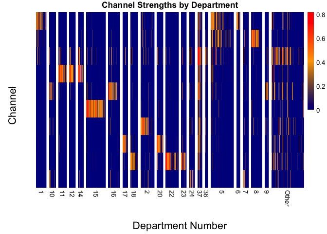

For this example, we will analyze a small [email
network](https://snap.stanford.edu/data/email-Eu-core.html). Nodes in
this network are faculty at a European department and edges represent
emails sent between them.

First we will load and examine the data.

    # Loading edge list
    edgeList = read.table("email-Eu-core.txt")
    head(edgeList)

    ##   V1 V2
    ## 1  0  1
    ## 2  2  3
    ## 3  2  4
    ## 4  5  6
    ## 5  5  7
    ## 6  8  9

Note node labels begin with 0. Our code expects nodes to begin with 1,
so we will edit this.

    edgeList = edgeList + 1
    unq_nodes = unique( c(edgeList[,1], edgeList[,2]) ) 
    cat("Number of nodes = ", length(unq_nodes),
        "\nNumber of edges = ", nrow(edgeList))

    ## Number of nodes =  1005 
    ## Number of edges =  25571

    label_table = read.table("email-Eu-core-department-labels.txt")
    # Labels don't have to start with 0, but why not
    label_table = label_table + 1
    # Second column is actual labels, first is ID
    head(label_table)

    ##   V1 V2
    ## 1  1  2
    ## 2  2  2
    ## 3  3 22
    ## 4  4 22
    ## 5  5 22
    ## 6  6 26

    labels = label_table[,2]

Note that departments have be anonymized and simply represented as an
integer.

Now we will build and fit our latent channel model.

    library(latChanNet)

    # Number of latent channels
    nChannels = 10

    # Building (but not fitting) model
    # seed is set because initial probabilities randomly assigned
    set.seed(123)
    mod = makeLCN(edgeList, nChannels)

    # Initial log-likelihood
    mod$llk()

    ## [1] -3409145

    # Running EM algorithm
    res = emLCN(mod, 10000)

    # Checking log-likelihood
    mod$llk()

    ## [1] -76898.37

Now our model has been fit. But how do we get a feel for the structure
of the network? One way to do this is to display a heatmap of the fitted
probabilities, sorted by department.

    # Many of the departments are *really* small, 
    # so we are going to bin all departments with 
    # less than 15 faculty to be more visually pleasing
    minGrpSize = 15

    heatmapLCN(mod, labels, minGrpSize = minGrpSize, 
               xlab = "Department Number", 
               ylab = "Channel", 
               main = "Channel Strengths by Department")

